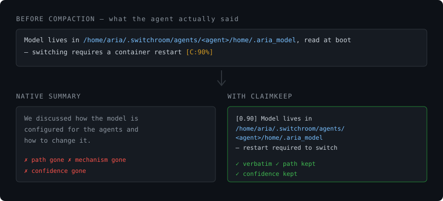

# ClaimKeep

[](LICENSE)
[](tests)
[](pyproject.toml)
[](https://zenodo.org/records/20819013)

Continuous memory for Claude Code. When the context window compacts, the summary keeps the gist
and drops the specifics — numbers, paths, ids, and decisions that were later reversed. ClaimKeep
runs before compaction, takes the agent's own confidence-marked statements **verbatim** instead of
paraphrasing them, and re-injects them afterwards. It augments native compaction rather than
replacing it, so it is never worse than the default.

https://github.com/user-attachments/assets/a0a6700e-8643-48a9-bc45-15a7f6c327fa

The idea it rests on: a calibration marker such as `Ship Friday [C:80%]` turns any factual sentence
into a claim the agent already selected and already rated. No guessing what mattered. A marker-free
regex floor still catches paths, ids, and decision lines when a transcript has no markers at all.
The brief contract is frozen and documented in [docs/BRIEF_SCHEMA.md](docs/BRIEF_SCHEMA.md).



The failure this addresses is specific. Compaction rarely forgets the topic; it forgets the exact
path, the port, the commit sha, the version that was ruled out. Those are the parts an agent cannot
reconstruct by reasoning, and the parts that turn a resumed session into a re-investigation. If your
sessions are short, you will never notice this. If you run long refactors, multi-day debugging, or
agent pipelines that compact several times a day, you have paid for it repeatedly.

Measured in production, not on a benchmark: **at least 326 compactions survived on two independent
platforms — 283 of them carried facts forward (86.8%), with one confirmed loss.**
Codex platform: 237 compactions, 84.4% carried facts, 2842 claims retained, one agent.
Claude Code fleet: 89 compactions, 93.3% carried facts, one real loss in 89 (98.9% clean).
"At least" is literal: only 5 of the 7 fleet agents write the counters, so the fleet figure is a
floor rather than a total. Loss is graded on the fleet side only — the Codex side counts
compactions and claims but does not classify a zero. Measurement windows are 19 and 8 days, ending
2026-08-10; the mechanism has been running longer than the instrumentation that counts it.

Read the figures above as a property of this setup rather than of the tool on its own: every agent
measured here already carries calibration markers in its system prompt, and marker density is what
the mechanism feeds on. A clean install, with no markers in the prompt, is a different environment;
that second figure is being measured separately and is not in this README yet. Until it is, treat
these numbers as an instrumented-fleet result, not as what a fresh install should expect.

Method and defensible lift numbers are in the paper, *"Continuous Memory for Multi-Agent
Infrastructure: A Calibration-Density Law for Surviving Context Compaction"* (Ravshan Nuraliev,
2026) — <https://zenodo.org/records/20819013>. Please cite the Zenodo record if you use ClaimKeep.

## How this differs from what you already have

`CLAUDE.md` and memory MCP servers store what **you** decided to write down, ahead of time. That is
curation, and it works well for stable facts — conventions, architecture, preferences.

ClaimKeep stores what the **agent** said during the session and is about to lose. Nobody types those
facts into a memory file: they are discovered mid-work, used for ten minutes, and dropped by the
summarizer — the port you just found, the hypothesis you ruled out, the path that turned out to be
the real one. The two layers do not compete; curated memory answers *how we do things here*, and
ClaimKeep answers *what did I just find out*.

Three properties follow from that scope, and they are the reasons to prefer it over rolling your own:

- **It augments, never replaces.** Native compaction still runs; the brief is added on top. The
  failure mode of "my memory layer summarized worse than the built-in one" cannot happen here.
- **It cannot stall your session.** Both hooks are fail-open by construction and always exit `0`.
- **It refuses to fake a zero.** If retractions cannot be measured, `stats` reports *not measurable*
  rather than `0`. A metric that cannot distinguish "clean" from "not instrumented" is the exact bug
  this package is built to avoid.

## Install

```bash
claude plugin marketplace add rushnur88/claimkeep
claude plugin install claimkeep
```

Two commands, and that is the whole install — no `pip install` step, no build, no dependencies:
the hooks run the bundled package straight from the plugin directory. Requirements are Claude Code
and Python 3.9+.

If you would rather have the CLI on your PATH as well, `pip install .` or `npm install -g .` both
work, and the hooks will prefer the installed binary when they find one.

Note that a memory layer reads your transcript. ClaimKeep runs a secret and PII redaction pass
before any text enters a brief (API keys, tokens, private-key blocks, JWTs, bearer tokens,
`key=value` secrets, emails), on by default via `Config.redact`. It targets well-known shapes and
is defense in depth, not a guarantee — it is not a reason to paste credentials into a session.

## Verify it works

Run the hook by hand against the bundled sample transcript. This is exactly what Claude Code runs
on `PreCompact`:

```bash
CLAIMKEEP_BRIEF_DIR=/tmp/ck-check ./scripts/precompact.sh <<'EOF'
{"transcript_path": "examples/sample_transcript.jsonl", "session_id": "verify-001"}
EOF
```

It prints the path of the brief it wrote. Confirm the brief exists and holds a claim:

```bash
cat /tmp/ck-check/*.json
```

You should see a `claims` array with `Ship ClaimKeep package Friday` at confidence `0.8`, plus a
`supplement` section with the ids, paths, and decision lines the floor picked up.

Then check the other half — re-injection:

```bash
CLAIMKEEP_BRIEF_DIR=/tmp/ck-check CLAUDE_HOOK_EVENT_NAME=PostCompact ./scripts/postcompact.sh <<< '{}'
```

It emits the `hookSpecificOutput.additionalContext` payload Claude Code feeds back into the fresh
window. If both commands produce output, the plugin is wired correctly.

Both hooks are fail-open on purpose — a memory layer must never block compaction, so they always
exit `0`. That means a broken install cannot stall your session, but it also means you should run
the two checks above once rather than assume silence equals success. Errors go to stderr.

Full test suite: `python3 -m unittest discover -s tests` (92 tests, standard library only).

## See what it did

`stats` reports across every brief you have stored, not just the last one:

```bash
claimkeep stats          # human-readable
claimkeep stats --json   # same numbers, machine-readable
```

It answers the question a single brief cannot: is the layer still earning its keep. Two lines matter
most. **Retractions** counts claims that overturn an earlier statement — a memory layer that keeps a
refuted claim and drops its refutation is worse than no memory at all. **Confidence-marked** is the
share of claims that arrived already carrying a `[C:NN%]` marker; when that share falls, the
convention is eroding and the calibration harvester quietly runs out of input.

If your briefs came from a different collector, `stats` reports retractions as *not measurable*
rather than as zero. A zero you cannot distinguish from "never happened" is the failure mode this
package is built around, and the report is not allowed to produce one.

---

Developed by Ravshan Nuraliev. MIT licensed.
