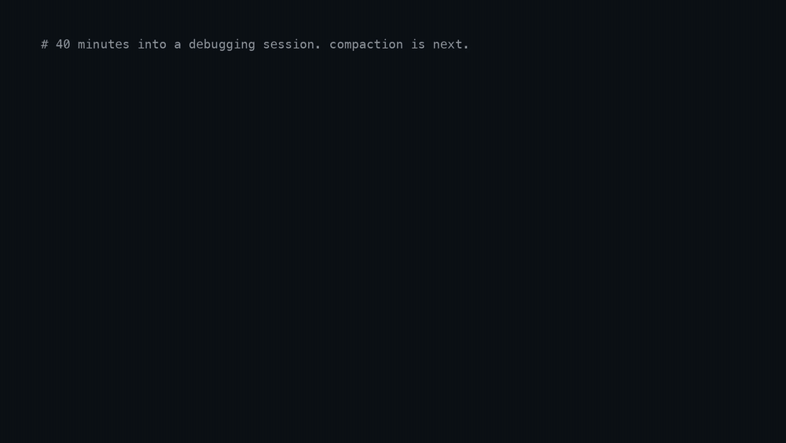

# ClaimKeep

[](LICENSE)
[](https://github.com/rushnur88/claimkeep/actions/workflows/tests.yml)
[](pyproject.toml)
[](https://zenodo.org/records/20819013)

Continuous memory for Claude Code. When the context window compacts, the summary keeps the gist
and drops the specifics — numbers, paths, ids, and decisions that were later reversed. ClaimKeep
runs before compaction, takes the agent's own confidence-marked statements **verbatim** instead of
paraphrasing them, and re-injects them afterwards. It augments native compaction rather than
replacing it, so it is never worse than the default.

https://github.com/user-attachments/assets/a0a6700e-8643-48a9-bc45-15a7f6c327fa

The idea it rests on: a calibration marker such as `Ship Friday [C:80%]` turns any factual sentence
into a claim the agent already selected and already rated. No guessing what mattered. A marker-free
regex floor still catches paths, ids, and decision lines when a transcript has no markers at all,
in English or Russian — the harvesters, the tokenizer and the redaction cues all work outside Latin.
The brief contract is frozen and documented in [docs/BRIEF_SCHEMA.md](docs/BRIEF_SCHEMA.md).



The failure this addresses is specific. Compaction rarely forgets the topic; it forgets the exact
path, the port, the commit sha, the version that was ruled out. Those are the parts an agent cannot
reconstruct by reasoning, and the parts that turn a resumed session into a re-investigation. If your
sessions are short, you will never notice this. If you run long refactors, multi-day debugging, or
agent pipelines that compact several times a day, you have paid for it repeatedly.

**Against the real control, at equal budget: 21.4% → 39.7% of frozen probes recovered, +18.3
points** — and on the family built to be unwinnable, 7.3% → 27.3%.

The control is not a simulation. Claude Code writes its own compaction summary to the transcript
(`compact_boundary`, `isCompactSummary`), so the naive arm was already on disk — 68 real compactions,
1,481 probes frozen before any result was seen. Each arm was given exactly the number of characters
the native summary spent on that same compaction, because an unbounded brief is not a comparison.

By probe family, at equal budget:

| family | native | ClaimKeep | |
|---|---|---|---|
| `fact` (bare number + word) | 7.3% | **27.3%** | **adversarial** — nothing in the plugin targets these |
| `hash` | 57.5% | 82.8% | biased toward the plugin — regex ≈ harvester |
| `path` | 71.9% | 62.5% | biased toward the plugin, and it still lost ground |
| `claim` (marked `[C:NN%]`) | 8.2% | 79.0% | excluded from the headline — see below |

Per compaction: **43 wins, 11 draws, 14 losses** out of 68, median +12.5, worst −33.3.

**Why `claim` is excluded.** Counting it, the same run gives 18.0% → 49.7%, +31.7 points. That is the
bigger number and it is not the one quoted. The harvester scopes a marker to the statement it
annotates, which is very nearly the string the probe extractor freezes — measured overlap between
the two, 95%. That family scores whether two regexes agree. Worth knowing, not honest to call
retention. `path` and `hash` carry a milder form of the same bias, which is why the adversarial
`fact` family exists and why it is quoted first.

**`path` went down, and the cause is a fix.** While a marker's confidence was applied to a whole
message, a claim dragged that message's paths in with it. Scoped claims are short and numerous, they
are packed before the supplement, and at equal budget they now crowd out the `regex_floor` items
that carry paths. Net across families it is still a clear win; on paths alone the native summary is
ahead, and the packing order is the obvious thing to revisit.

**The first version of this number was +59 points, and it was wrong three ways.** Matches were
counted anywhere in the output rather than co-located in one item, so "12" scored inside
"2026-08-10". The arms were not the same size — the native summary spent 15,093 characters and the
unbounded brief 3,541,462, a factor of 235. And the path and hash probes were extracted with the
same class of regex the harvester uses, which is how they reached 100%. Fixing all three took the
result from +59 to +17.8. Two harvester defects found in a later audit moved it again, to the table
above; both are in [CHANGELOG.md](CHANGELOG.md), and any figure published before that audit was
measured on the defective behaviour.

Limits, since they decide whether the number transfers: one corpus, one agent, so generalisation is
untested. Full method and per-compaction data: `benchmark/`, and the paper below.

### What a fresh install gets

Your transcripts carry no `[C:NN%]` markers, and these do, so the difference is measured rather than
assumed: markers stripped from the text the harvesters see, probes frozen from the original so the
arms stay comparable, three arms in one pass. The `claim` family is excluded throughout — it is
marker-defined by construction. 68 compactions, 1,104 probes.

| arm | overall | `fact` | `hash` | `path` |
|---|---|---|---|---|
| native summary | 21.4% | 7.3% | 57.5% | 71.9% |
| ClaimKeep, markers present | 39.7% | 27.3% | 82.8% | 62.5% |
| ClaimKeep, markers stripped | **47.5%** | 31.1% | 95.7% | 93.8% |

**+18.3 points with markers, +26.1 without.** A marker-free install is not the degraded case here —
on these families it is the stronger one, 53 wins to 9 losses, median +22.5.

The reason is the budget. Strip the markers and `calibration` produces nothing, so the entire brief
is `regex_floor` output: paths, ids, decision lines. Those are exactly what the probes in this table
ask for, and retention goes to 93.8% and 95.7%. Add markers back and 46 claims per compaction take
their share of the same fixed budget, pushing floor items out — which is why `path` is *lower* with
markers than without.

So markers do not buy path and id retention; they buy the one thing the floor cannot produce, the
agent's own statements. Those are the `claim` family in the table above: 8.2% in the native summary
against 79% here, on probes the floor does not target at all. Whether that trade is worth it depends
on what your compactions actually cost you — ids and paths, or reasoning and conclusions.

One limit this design cannot escape: the native summary was written by a model that could see the
markers. That arm cannot be re-run without them, so if markers helped the control, the marker-free
delta is understated.

Both tables come from one script, on your own sessions:

```bash
python benchmark/natural_experiment.py ~/.claude/projects/<your-project-dir>
```

It finds the compactions Claude Code already recorded, freezes the probes before scoring, and prints
the headline and the marker-free arms. Any transcript directory with a few compactions in it works.

Separately, as live telemetry rather than a controlled comparison: on a Codex deployment (see
[integrations/codex/](integrations/codex/)) the
plugin has written **267 briefs since 22 July, 249 of which carried facts forward (93.3%), 3,564
claims retained**. That says the mechanism runs and produces non-empty briefs in daily use. It says
nothing about what the native summary would have kept — only the measurement above does.

Method and defensible lift numbers are in the paper, *"Continuous Memory for Multi-Agent
Infrastructure: A Calibration-Density Law for Surviving Context Compaction"* (Ravshan Nuraliev,
2026) — <https://zenodo.org/records/20819013>. Please cite the Zenodo record if you use ClaimKeep.

## How this differs from what you already have

`CLAUDE.md` and memory MCP servers store what **you** decided to write down, ahead of time. That is
curation, and it works well for stable facts — conventions, architecture, preferences.

ClaimKeep stores what the **agent** said during the session and is about to lose. Nobody types those
facts into a memory file: they are discovered mid-work, used for ten minutes, and dropped by the
summarizer — the port you just found, the hypothesis you ruled out, the path that turned out to be
the real one. The two layers do not compete; curated memory answers *how we do things here*, and
ClaimKeep answers *what did I just find out*.

Three properties follow from that scope, and they are the reasons to prefer it over rolling your own:

- **It augments, never replaces.** Native compaction still runs; the brief is added on top. The
  failure mode of "my memory layer summarized worse than the built-in one" cannot happen here.
- **It cannot stall your session.** Both hooks are fail-open by construction and always exit `0`.
- **It refuses to fake a zero.** If retractions cannot be measured, `stats` reports *not measurable*
  rather than `0`. A metric that cannot distinguish "clean" from "not instrumented" is the exact bug
  this package is built to avoid.

## Install

```bash
claude plugin marketplace add rushnur88/claimkeep
claude plugin install claimkeep
```

Two commands, and that is the whole install — no `pip install` step, no build, no dependencies:
the hooks run the bundled package straight from the plugin directory. Requirements are Claude Code
and Python 3.9+.

If you would rather have the CLI on your PATH as well, `pip install .` or `npm install -g .` both
work, and the hooks will prefer the installed binary when they find one.

Note that a memory layer reads your transcript. ClaimKeep runs a secret and PII redaction pass
before any text enters a brief (API keys, tokens, private-key blocks, JWTs, bearer tokens,
`key=value` secrets whatever prefix the variable name carries — `DB_PASSWORD`, `OPENAI_API_KEY`,
`AWS_SECRET_ACCESS_KEY` — a high-entropy blob introduced by a secret word, and emails), on by
default via `Config.redact`. It targets well-known shapes and is defense in depth, not a
guarantee — it is not a reason to paste credentials into a session.

## Codex CLI

ClaimKeep is built for Claude Code, which fires `PreCompact` and `SessionStart`. Codex CLI has
neither hook, so [`integrations/codex/`](integrations/codex/) supplies both: it harvests when
`turn.completed.usage.input_tokens` crosses a threshold, and injects the newest brief into the
`AGENTS.md` block Codex reads on every run. The package itself is used unchanged — the bridge
shells out to the same `claimkeep precompact` the Claude Code hook does, so fixes reach both paths
at once.

Stdlib only, seven tests, verified against Codex CLI 0.145.0. Setup and the two call sites are in
[integrations/codex/README.md](integrations/codex/README.md).

## Verify it works

Run the hook by hand against the bundled sample transcript. This is exactly what Claude Code runs
on `PreCompact`:

```bash
CLAIMKEEP_BRIEF_DIR=/tmp/ck-check ./scripts/precompact.sh <<'EOF'
{"transcript_path": "examples/sample_transcript.jsonl", "session_id": "verify-001"}
EOF
```

It prints the path of the brief it wrote. Confirm the brief exists and holds a claim:

```bash
cat /tmp/ck-check/*.json
```

You should see a `claims` array with `Ship ClaimKeep package Friday` at confidence `0.8`, plus a
`supplement` section with the ids, paths, and decision lines the floor picked up.

Then check the other half — re-injection:

```bash
CLAIMKEEP_BRIEF_DIR=/tmp/ck-check CLAUDE_HOOK_EVENT_NAME=PostCompact ./scripts/postcompact.sh <<< '{}'
```

It emits the `hookSpecificOutput.additionalContext` payload Claude Code feeds back into the fresh
window. If both commands produce output, the plugin is wired correctly.

Both hooks are fail-open on purpose — a memory layer must never block compaction, so they always
exit `0`. That means a broken install cannot stall your session, but it also means you should run
the two checks above once rather than assume silence equals success. Errors go to stderr.

Full test suite: `python3 -m unittest discover -s tests` (148 tests, standard library only).

The benchmarks run from a clone too — `python3 benchmark/russian_recall.py --db <store>`
and the scripts under `benchmark/longmemeval/`. They used to carry absolute paths from the
machine they were written on and could not start anywhere else, which made the numbers above
unreproducible by anyone but the author. CI now starts every one of them on each push.

## See what it did

`stats` reports across every brief you have stored, not just the last one:

```bash
claimkeep stats          # human-readable
claimkeep stats --json   # same numbers, machine-readable
```

It answers the question a single brief cannot: is the layer still earning its keep. Two lines matter
most. **Retractions** counts claims that overturn an earlier statement — a memory layer that keeps a
refuted claim and drops its refutation is worse than no memory at all. **Confidence-marked** is the
share of claims that arrived already carrying a `[C:NN%]` marker; when that share falls, the
convention is eroding and the calibration harvester quietly runs out of input.

**Dropped by budget** appears whenever the brief did not fit `budget_chars`, with the share of the
harvest that survived. A long session can harvest twenty thousand claims and keep under two hundred
of them; "claims kept" alone reads as the whole harvest and hides that the budget, not the
transcript, decided what you get back.

If your briefs came from a different collector, `stats` reports retractions as *not measurable*
rather than as zero. A zero you cannot distinguish from "never happened" is the failure mode this
package is built around, and the report is not allowed to produce one.

That holds in `--json` too: `retractions` is `null` — never `0` — whenever the count is
unavailable, alongside an explicit `retractions_measurable` flag, and `lessons_total` is `null`
when there is no lesson store to read. The machine-readable output is where a false zero does the
most damage, because a dashboard will plot it as a clean result and nobody will ask again.

---

Developed by Ravshan Nuraliev. MIT licensed.
